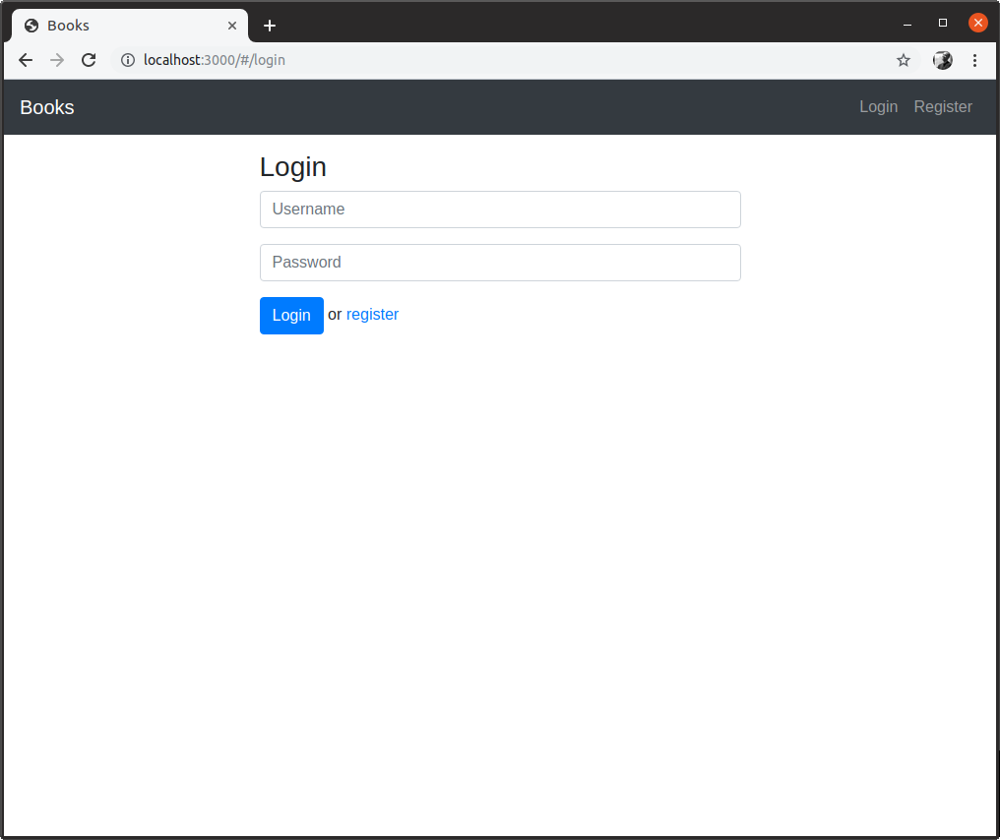
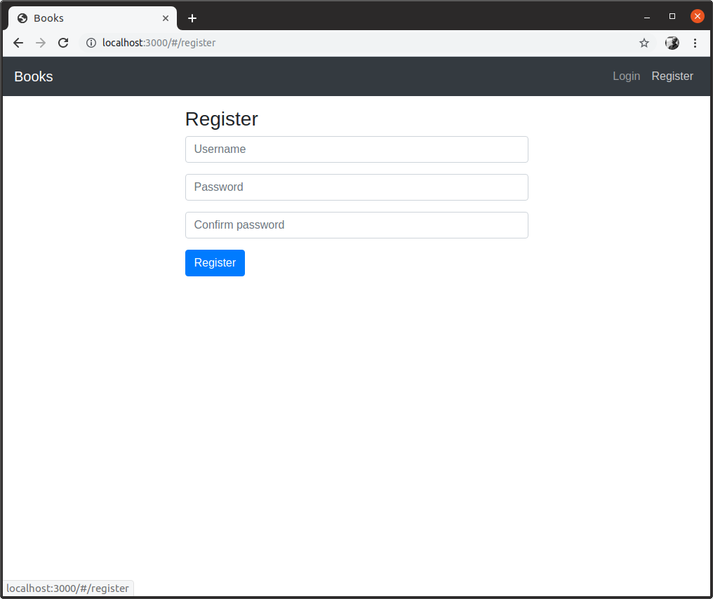
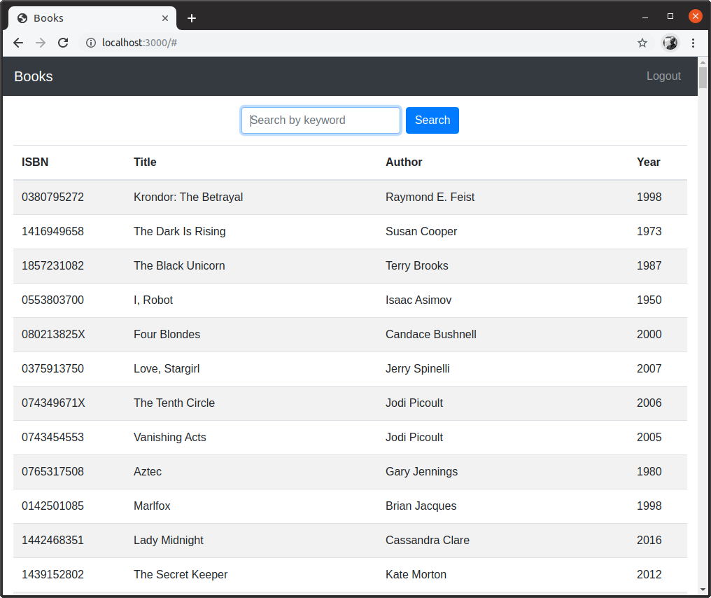
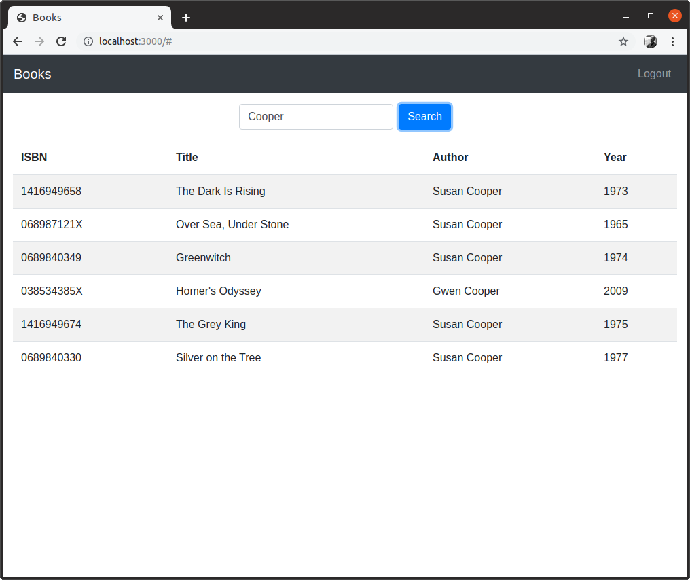

# Books

## Requirements

1. Run `npm i` to install all dependencies.

## Development

Run:

```
npm run dev
```

then visit http://localhost:3000/ in your browser. This command will set your "JWT_SECRET" (a webtoken middleware we are using to authenticate users, as well as run your application in "dev mode," allowing you to make changes and see those changes take effect immediately.)

## Notes

Already in the `users` database is a user with username `guest` and password `guest`, which you can use to test login functionality.

## Screenshots





